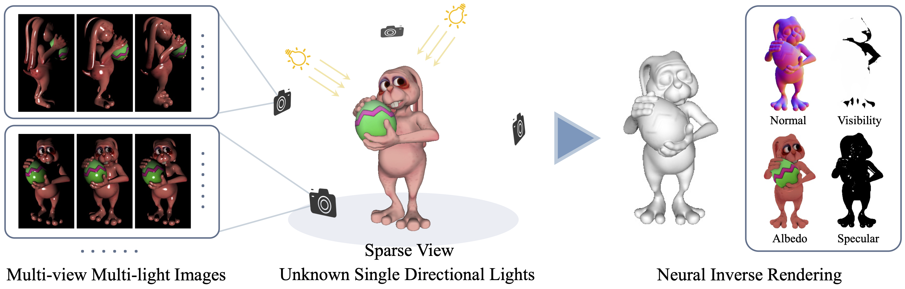

# PS-NeRF: Neural Inverse Rendering for Multi-view Photometric Stereo (ECCV 2022)

### [Project Page](https://ywq.github.io/psnerf/) | [Paper](http://arxiv.org/abs/2207.11406) 

<p align="center">
    
</p>


This repository contains the implementation of the paper:

**PS-NeRF: Neural Inverse Rendering for Multi-view Photometric Stereo**  
[Wenqi Yang](https://ywq.github.io/),
[Guanying Chen](https://guanyingc.github.io/), 
[Chaofeng Chen](http://chaofengc.github.io/),
[Zhenfang Chen](https://zfchenunique.github.io/),
[Kwan-Yee K. Wong](http://i.cs.hku.hk/~kykwong/)  
European Conference on Computer Vision (ECCV), 2022

## Abstract
Traditional multi-view photometric stereo (MVPS) methods are often composed of multiple disjoint stages, resulting in noticeable accumulated errors. In this paper, we present a neural inverse rendering method for MVPS based on implicit representation. Given multi-view images of a non-Lambertian object illuminated by multiple unknown directional lights, our method jointly estimates the geometry, materials, and lights. Our method first employs multi-light images to estimate per-view surface normal maps, which are used to regularize the normals derived from the neural radiance field. It then jointly optimizes the surface normals, spatially-varying BRDFs, and lights based on a shadow-aware differentiable rendering layer. After optimization, the reconstructed object can be used for novel-view rendering, relighting, and material editing. Experiments on both synthetic and real datasets demonstrate that our method achieves far more accurate shape reconstruction than existing MVPS and neural rendering methods. Our code and model will be made publicly available.

<p align="center">
    
</p>

## Setup
Our work is implemented in PyTorch and tested with Ubuntu 18.04/20.04.
- Python 3.9
- PyTorch 1.8.0

Create an anaconda environment called `psnerf` using
```
conda env create -f environment.yaml
conda activate psnerf
```


## Download

Download the dataset and trained models using
```
sh download.sh
```
If the above command is not working, please manually download the files:
- Released models of SDPS-Net from Google Drive ([LCNet and NENet](https://drive.google.com/drive/folders/1HCW9YDfsFoPxda3GDTjj3L5yuQUXw8a3?usp=sharing)) and put them in `preprocessing/data/models/`;
- Trained models of our method from OneDrive ([data.tgz](https://connecthkuhk-my.sharepoint.com/:f:/g/personal/wenqi_connect_hku_hk/Et3Qh3fV3H9Lk71Bln0YEQABBzu8eBUfTp44dcqtaz18sQ?e=WUCR12)) and put the extracted folder `data/` under the project path;
- Preprocessed dataset of both synthetic and real objects from OneDrive ([dataset.tgz](https://connecthkuhk-my.sharepoint.com/:f:/g/personal/wenqi_connect_hku_hk/Et3Qh3fV3H9Lk71Bln0YEQABBzu8eBUfTp44dcqtaz18sQ?e=WUCR12)) and put the extracted folder `dataset/` under the project path;
- Environment maps for relighting application from OneDrive ([envmap.tgz](https://connecthkuhk-my.sharepoint.com/:f:/g/personal/wenqi_connect_hku_hk/Et3Qh3fV3H9Lk71Bln0YEQABBzu8eBUfTp44dcqtaz18sQ?e=WUCR12)) and put the extracted folder `envmap/` under `stage2/`.

### Dataset
The real dataset was processed from [DiLiGenT-MV Dataset](https://sites.google.com/site/photometricstereodata/mv?authuser=0), which contains 5 objects `BEAR`, `BUDDHA`, `COW`, `POT2`, `READING`.

The synthetic dataset was rendered using [Mitsuba](https://www.mitsuba-renderer.org/), which contains 2 objects `BUNNY`, `ARMADILLO`.

After downloaded and extracted, you can find the processed datasets in `./dataset` folder.
### Model
We release the pretrained models of the 5 real scenes. After downloaded and extracted, you can find them in `./data` folder.


##  Test & Evaluation
After download the pretrained models, you may run the following code to test and evalauate the results. (You may specify the `OBJ_NAME` from  `bear`, `buddha`, `cow`, `pot2`, `reading`.) 
```bash
## Please replace the `GPU_ID` and `OBJ_NAME` with your choices.
cd stage2
python eval.py --gpu GPU_ID --obj_name OBJ_NAME --expname test_1 --exps_folder ../data/stage2
cd ..

python evaluation.py --obj OBJ_NAME --expname test_1 --test_out_dir stage2/test_out
```
For testing and evaluating on your own trained models:
```bash
## Please replace the `GPU_ID`, `OBJ_NAME` and `EXPNAME` with your choices.
cd stage2
python eval.py --gpu GPU_ID --obj_name OBJ_NAME --expname EXPNAME
cd ..
## other optional arguments
# --exps_folder EXP_FOLDER        # specify exp_folder (default: ./out)
# --test_out_dir TEST_OUT_DIR     # test_out_dir (default: ./test_out)
# --save_npy                      # save npy files
# --timestamp TIMESTAMP           # specify the timestamp (default: latest)
# --checkpoint CHECKPOINT         # specify the checkpoint (default: latest)
# --light_batch N_LIGHT           # modify light batch according to your GPU memory (default: 64)

## Please replace the `OBJ_NAME`, `EXPNAME` and `TEST_OUT_DIR` with your choices.
python evaluation.py --obj OBJ_NAME --expname EXPNAME --test_out_dir TEST_OUT_DIR
```


##  Train
To train a model from scratch, you need to first prepare the training data from [Preprocessing](./preprocessing) with pretrained [SDPS-Net](https://github.com/guanyingc/SDPS-Net). After that you will obtain the coarse normal/light direction/light intensity estimations from the dataset.  
Then you need to calculate the light-averaged images (see below) for training [Stage I](./stage1). For convenience, we extract the surface/normal for each view and visibility for each light direction to accelerate the [Stage II](./stage2) training process.  
After [Stage II](./stage2) training phase is finished, you may test and evaluate the final results. Please go to the subpages and follow the detailed instructions there.
- Prepare light-averaged images for stage I
    ```bash
    ## replace `OBJ_NAME` with your choice.
    python light_avg.py --obj OBJ_NAME --path dataset
    ## other optional arguments
    # --train_light          # specify the train_light
    # --light_intnorm        # enable it if use GT/SDPS-Net light intensity to normalize the images
    # --sdps                 # enable it if use light intensity predicted by SDPS-Net (you should also enable `--light_intnorm`)
    ```

- The overall workflow is as follows:
    ```bash
    cd preprocessing
    python test.py xxxx
    cd ..
    python light_avg.py xxxx
    cd stage1
    python train.py xxxx
    python shape_extract.py xxxx
    cd ../stage2
    python train.py xxxx
    python eval.py xxxx
    cd ..
    python evaluation.py xxxx
    ```

## Relighting and Material Editing
Our method jointly estimates surface normals, spatially-varying BRDFs, and lights. After optimization, the reconstructed objects can be used for novel-view rendering, relighting, and material editing. You may render under environmental lighting and edit materials with the trained models for applications. Please follow the instructions in [Stage II](./stage2#relighting-and-material-editing).


## Prepare your own data
We provide preprocessed datasets, if you want to try with your own data, please prepare your dataset and parameters as follows.
- Data Structure
```
└── OBJ_NAME
    ├── params.json
    ├── img
    │   ├── view_01
    │   │   ├── 001.png
    │   │   └── ...
    │   └── ...
    │       ├── 001.png
    │       └── ...
    ├── mask
    │   ├── view_01.png
    │   └── ...
    ├── norm_mask
    │   ├── view_01.png
    │   └── ...
    ├── normal (optional)
    │   ├── img
    │   │   ├── view_01.png
    │   │   └── ...
    │   └── npy
    │       ├── view_01.png
    │       └── ...
    └── visibility (optional)
        ├── view_01
        │   ├── 001.png
        │   └── ...
        └── ...
            ├── 001.png
            └── ...
```
- Parameters in `params.json`
```
== PARAM ==             == HELP ==
obj_name                name of the object
n_view                  total number of views (train + test)            
imhw                    resolution of images as [H,W]
gt_normal_world         whether normal is in world coordinate system
view_train              index of training views         
view_test               index of testing views         
K                       K matrix 
pose_c2w                camera-to-world transformation matrix of all views         
light_is_same           whether lights are the same among all views             
light_direction         list of light directions for each view as [L1*3, L2*3, ...], (if `light_is_same`, only one view is provided as L*3)         
light_intensity         (optional) list of light intensity for each view as [L1*3, L2*3, ...], (if `light_is_same`, only one view is provided as L*3)         
view_slt_N              (optional) index of selected N views for training         
light_slt_N             (optional) index of selected N lights for training
```


## Citation
If you find this code or the provided models useful in your research, please consider cite: 
```bibtex
@inproceedings{yang2022psnerf,
    title={PS-NeRF: Neural Inverse Rendering for Multi-view Photometric Stereo},
    author={Yang, Wenqi and Chen, Guanying and Chen, Chaofeng and 
            Chen, Zhenfang and Wong, Kwan-Yee K.},
    booktitle={European Conference on Computer Vision (ECCV)},
    year={2022}
}
```


## Acknowledgement
Part of our code is based on the awesome [SDPS-Net](https://github.com/guanyingc/SDPS-Ne), [UNISURF](https://github.com/autonomousvision/unisurf), and [PhySG](https://github.com/Kai-46/PhySG).
